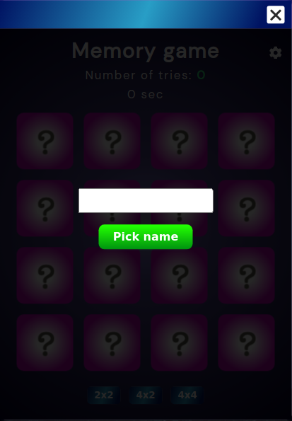

# &lt;dav-application-window&gt;

This is a web component simulating a application window. It is responsible for holding applications and also for the functionality to move and delete an application instance.

## Attributes

No attributes available for this component!

## Methods

No public methods are meant to be used for this component!

## Slot

Has a slot with the name of application container that holds the current app instance.

## Custom Events

| Event Name          |  Fired When                                                                         |
| ------------------- | ----------------------------------------------------------------------------------- |
| `deleteAppInstance` | When this event is triggered the app instance which the window holds, gets deleted. |

## Styling with CSS

Styling with css is done from within the template in the custom element. Some styles are also applied through styles.css in public css folder.

## Example

How it is used in this application:

```
document.addEventListener('createNewAppInstance', ({ detail: { applicationName } }) => {
  // Creating a new instance of a specific application based on the detail name.
  const application = document.createElement(applicationName)
  const applicationWindow = document.createElement('dab-application-window')
  applicationWindow.setAttribute('slot', 'application')

  application.setAttribute('slot', 'application-container')

  applicationWindow.appendChild(application)

  applicationWindow.style.position = 'absolute'
  applicationWindow.style.top = `${windowPositionTop}%`
  applicationWindow.style.left = `${windowPositionLeft}%`
  applicationWindow.style.transform = `translate(${translationPositionX}%, ${translationPositionY}%)`

  windowPositionTop -= 1
  windowPositionLeft -= 1

  applicationArray.push(applicationWindow)

  pwdApplication.appendChild(applicationWindow)

  applicationWindow.addEventListener(('mousedown'), () => {
    applicationWindow.style.zIndex = 1000

    // Setting the z-index to 1 on all other applications that are not the current one.
    applicationArray.filter((app) => app !== applicationWindow).forEach((app) => {
      app.style.zIndex = 1
    })
  })
})
```

An example of the application window with the memory game in the slot.


