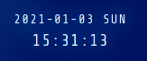

# &lt;dab-quiz-application&gt;

This is a web component simulating a digital clock. It is used to display the current time, date and day.

## Attributes

No attributes available for this component!

## Methods

No public methods are meant to be used for this component!

## Custom Events

| Event Name       |  Fired When                                                       |
| ---------------- | ----------------------------------------------------------------- |
| `pickedChatName` | Dispatches when a nickname is picked and gets stored in indexedDB |

## Styling with CSS

Styling with css is done from within the template in the custom element. Some styles are also applied through styles.css in public css folder.

## Example

```html
<dab-digital-clock
  slot="application-clock"
  id="application-clock"
  name="dab-digital-clock"
/>
```


