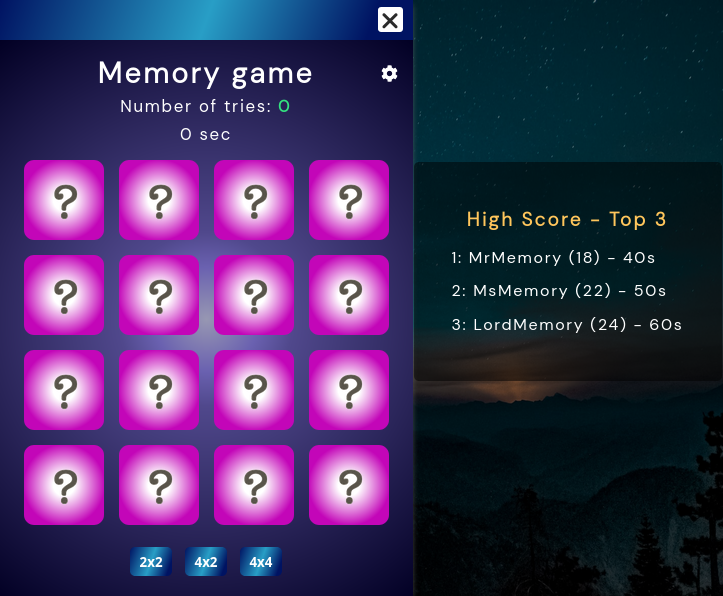

# &lt;dab-memory-game&gt;

This is a web component simulating a memory game.

## Attributes

### `boardsize`

A string representing the name current boardsize.

Default value: "Large" - Gets set in connected callback.

## Methods

This component have no public methods!

## Custom Events

| Event Name         |  Fired When                                                                            |
| ------------------ | -------------------------------------------------------------------------------------- |
| `updateHighscore`  | The event triggers the update of the current highscore.                                |
| `resetMemoryGame`  | This event is responsible for resetting the memory game.                               |
| `memoryGameOver`   | An event triggered when the game is over and is responsible for updating the database. |
| `pickedMemoryName` | An event triggered a nickname is picked.                                               |

## Styling with CSS

Styling with css is done from within the template in the custom element. Some styles are also applied through styles.css in public css folder.

## Example

How it is created in this application:

```
document.addEventListener('createNewAppInstance', ({ detail: { applicationName } }) => {
  // Creating a new instance of a specific application based on the detail name.
  const application = document.createElement(applicationName)
  const applicationWindow = document.createElement('dab-application-window')
  applicationWindow.setAttribute('slot', 'application')

  application.setAttribute('slot', 'application-container')

  applicationWindow.appendChild(application)

  applicationWindow.style.position = 'absolute'
  applicationWindow.style.top = `${windowPositionTop}%`
  applicationWindow.style.left = `${windowPositionLeft}%`
  applicationWindow.style.transform = `translate(${translationPositionX}%, ${translationPositionY}%)`

  windowPositionTop -= 1
  windowPositionLeft -= 1

  applicationArray.push(applicationWindow)

  pwdApplication.appendChild(applicationWindow)

  applicationWindow.addEventListener(('mousedown'), () => {
    applicationWindow.style.zIndex = 1000

    // Setting the z-index to 1 on all other applications that are not the current one.
    applicationArray.filter((app) => app !== applicationWindow).forEach((app) => {
      app.style.zIndex = 1
    })
  })
})
```


