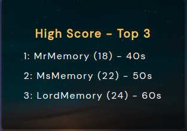

# &lt;dab-high-score&gt;

This is a web component simulating a high-score. It is a part of the memory-game application.

## Attributes

### `size`

A string representing the highscore size.

Default value: None

## Methods

### `updateHighscore(highscoreToBeDisplayed)`

Takes a string as parameter regarding which highscore that should be displayed. There after data is fetched from indexedDB and displayed in the highscore component.

## Custom Events

This component has no custom events!

## Styling with CSS

Styling with css is done from within the template in the custom element. Some styles are also applied through styles.css in public css folder.

## Example

It is used like this in the dab-memory-component.

```html
<dab-high-score class="high-score-component"></dab-high-score>
```


