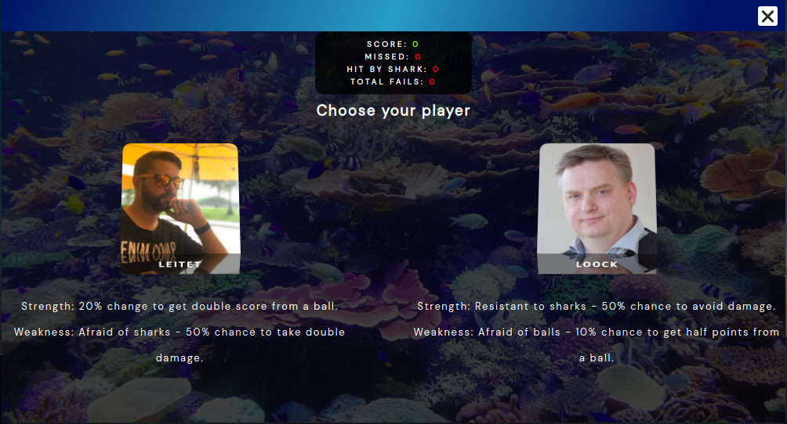

# &lt;dab-shark-bubble-game&gt;

This is a web component simulating a quiz-application. It is the main component in this application surround the other web components.

## Attributes

This component have no attributes!

## Methods

This componet does not have any public methods!

## Custom Events

| Event Name       |  Fired When                                                      |
| ---------------- | ---------------------------------------------------------------- |
| `sharkGameEnded` | Responsible for removing balls and sharks when the game is done. |

## Styling with CSS

Styling with css is done from within the template in the custom element. Some styles are also applied through styles.css in public css folder.

## Example

Example how the application is created.

```
document.addEventListener('createNewAppInstance', ({ detail: { applicationName } }) => {
  // Creating a new instance of a specific application based on the detail name.
  const application = document.createElement(applicationName)
  const applicationWindow = document.createElement('dab-application-window')
  applicationWindow.setAttribute('slot', 'application')

  application.setAttribute('slot', 'application-container')

  applicationWindow.appendChild(application)

  applicationWindow.style.position = 'absolute'
  applicationWindow.style.top = `${windowPositionTop}%`
  applicationWindow.style.left = `${windowPositionLeft}%`
  applicationWindow.style.transform = `translate(${translationPositionX}%, ${translationPositionY}%)`

  windowPositionTop -= 1
  windowPositionLeft -= 1

  applicationArray.push(applicationWindow)

  pwdApplication.appendChild(applicationWindow)

  applicationWindow.addEventListener(('mousedown'), () => {
    applicationWindow.style.zIndex = 1000

    // Setting the z-index to 1 on all other applications that are not the current one.
    applicationArray.filter((app) => app !== applicationWindow).forEach((app) => {
      app.style.zIndex = 1
    })
  })
})
```


